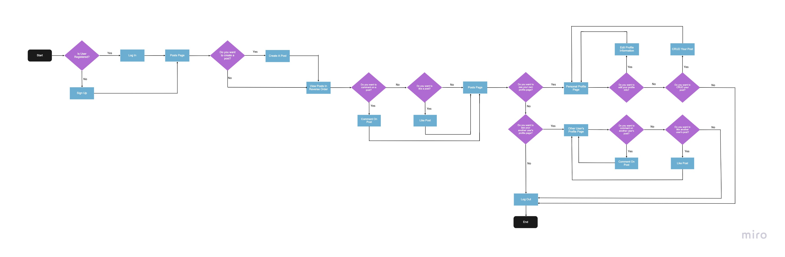
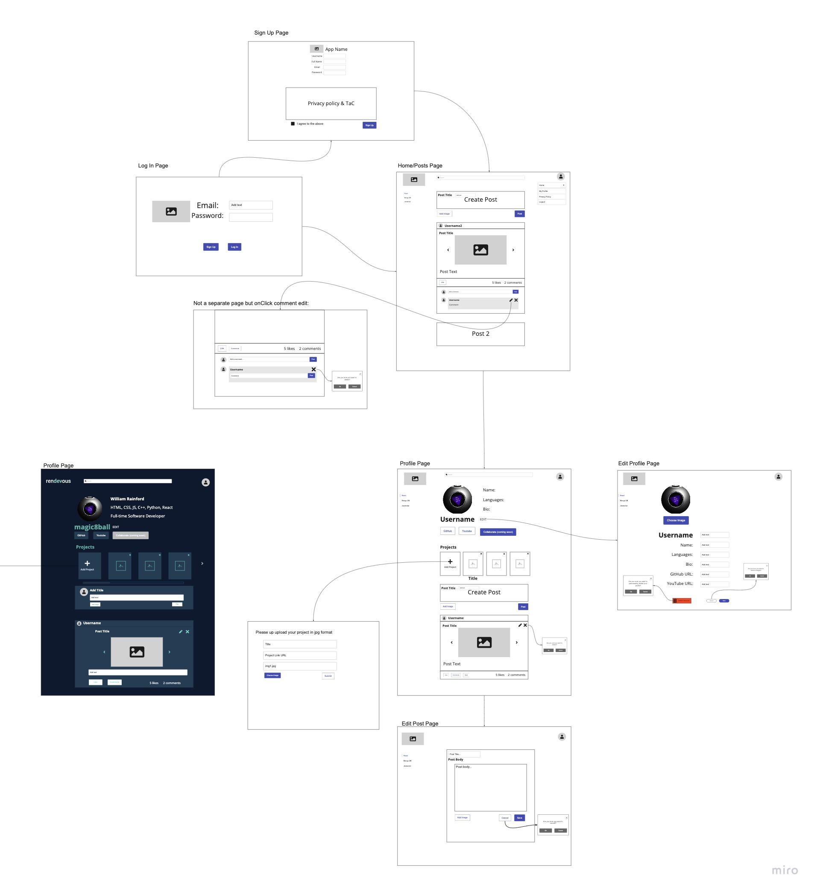
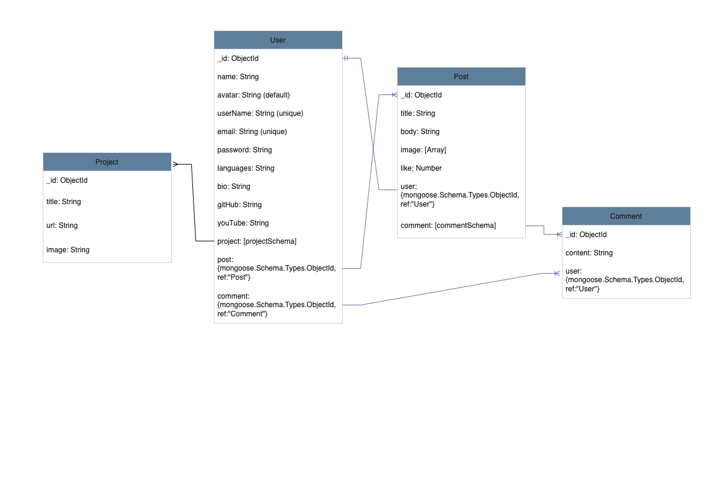

# renDEVous
Rendevous is a social media platform that provides a space to share content for developers by developers. It aims to connect professionals of different skill levels and backgrounds, to foster a learning environment of different skill levels, and to uplift the spirit of community in a rapidly progressing age of technology. The app strives to create a casual collaborative and  networking environment, where developers have an opportunity to connect and share their mini portfolio projects with each other and exchange ideas.

 

## Table of Contents
[Get Started](https://github.com/PredatorR10/Rendevous/#get-started) 
|
[Brainstorming](https://github.com/PredatorR10/Rendevous/#brainstorming) 
|
[Technologies Used](https://github.com/PredatorR10/Rendevous/#technologies-used)
|
[Unsolved Problems](https://github.com/PredatorR10/Rendevous/#unsolved-problems)
|
[Future Enhancements](https://github.com/PredatorR10/Rendevous/#future-enhancements)

## Get Started
See our deployed app here: 

## Brainstorming
Our UX survey research revealed that our target users are primarily younger developers starting out in their career who already have social media integrated into their lives. Users showed interest in sharing their GitHub or Youtube links (or their other portfolios), seeing different code tips and tricks, and a reliable privacy policy. With the most popular type of media content being photo, our app utilizes upload image function to easily share visualizations.

### User Story
- As a new user, I want to sign up for an account
- As an existing user, I want to log in securely
- As a user, I want to see an error when login fails
- AAU, I want to see all posts
- AAU, I want to be able to CRUD post
- AAU, I want to CRUD my comments on any posts
- AAU, I want to see and edit my own profile information
- AAU, I want to have the option to delete my profile
- AAU, I want to visit another user's page and be able to see their info
- AAU, I want to link my projects to my page 
- AAU, I want to see other user's projects on their profile page 

### User Flow

### Wireframe

### Data ERD 

## Technologies Used:
- MongoDB
- Express
- React
- Node.js
- Axios
- JsonWebToken
- Bcrypt

## Unsolved Problems:

## Future Enhancements:
